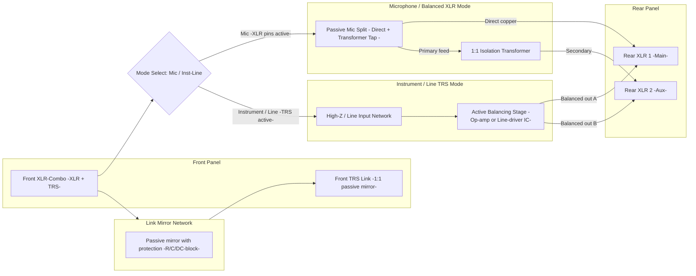

# RecRack: Hybrid Active/Passive Interface Design

## 1. Design Goals
RecRack is a multi-channel professional interface designed to accept any input type through a single front XLR-combo connector and deliver:

- a strict, passive, 1:1 Link copy of the input signal, regardless of whether it is balanced or unbalanced;
- always two balanced rear XLR outputs (Direct and Aux), using either fully passive topology (microphone signals) or active balancing (instrument/line signals);
- correct phantom-power handling and galvanic isolation where required.

The architecture guarantees fail-safe microphone operation while enabling high-fidelity active balancing for unbalanced sources.

## 2. Channel Architecture

Front:
- 1 x XLR-Combo input (XLR for microphones, TRS for instrument/line).
- 1 x TRS Link output: always a 1:1 passive mirror of the Combo input.

Rear:

- XLR 1: always balanced output
  – microphone mode: direct, passive, phantom-safe
  – instrument/line mode: active balanced
- XLR 2: always balanced output
  – microphone mode: transformer-isolated
  – instrument/line mode: active balanced (duplicate of XLR 1)

## 3. Link Output: Universal Passive 1:1 Mirror

The Link TRS provides a direct, protected, passive copy of the exact signal on the Combo input:

Case A – Microphone (balanced):
Link TRS outputs balanced through appropriate series protection.

Case B – Balanced line:
Link TRS outputs the same balanced line signal.

Case C – Unbalanced instrument/line:
Link TRS outputs the same unbalanced signal.

The Link is never affected by active circuitry or mode selection.

## 4. Microphone Mode (fully passive with isolation)
### 4.1 Signal Flow

Input:
Front XLR section of the Combo connector.

Link:
Direct passive mirror of the balanced mic signal.

Rear XLR 1 (Direct):
Straight copper pass-through from the input pins, preserving full phantom capability.

Rear XLR 2 (Iso):
Driven from the secondary of a 1:1 isolation transformer whose primary is tapped from the same mic input. Phantom from the Aux mixer remains isolated.

### 4.2 Phantom Power

- Phantom from the main console on XLR 1 reaches the microphone through the direct copper path.
- Phantom on XLR 2 is confined to the transformer secondary.
- The Link output is protected with DC blockers and current-limit elements so attached devices are not exposed to 48 V.

## 5. Instrument/Line Mode (active balancing)

### 5.1 Signal Flow

Input:
Front TRS section of the Combo connector.

Link:
Direct, passive, 1:1 unbalanced mirror of the Combo input.

Balancing stage:
Signal enters a high-impedance input network feeding either:
- dual-op-amp topology (buffer + inverter), or
- dedicated balanced line-driver IC.

The stage generates two matched balanced outputs.

Rear XLR 1 (Main):
Receives active balanced output.

Rear XLR 2 (Aux):
Receives a second active balanced output (electrically identical).

### 5.2 Phantom Power
- Phantom appearing on either XLR output is blocked from reaching the instrument input or internal low-voltage electronics.
- Protection includes series resistors, DC blockers, diode clamps and ESD networks.

## 6. Unified Operating Table

Input type → Link → XLR1 → XLR2

Microphone, balanced
→ Link: balanced passive
→ XLR1: balanced passive direct with full phantom
→ XLR2: balanced transformer-isolated

Balanced line
→ Link: balanced passive copy
→ XLR1: balanced passive or active (depending on system choice; recommended passive microphone topology only when on XLR pins)
→ XLR2: balanced transformer-isolated or active

Unbalanced instrument/line
→ Link: unbalanced passive copy
→ XLR1: balanced active
→ XLR2: balanced active

Note: For simplicity and consistency, the recommended implementation is:
- Microphone input → passive/transformer topology (XLR1 direct, XLR2 iso)
- TRS instrument/line input → active driver feeding both XLR1 and XLR2

## 7. Topology Summary

### 7.1 Passive Microphone Handling
- Direct copper path to XLR1
- Transformer-isolated feed to XLR2
- Link is a tapped mirror of the input

### 7.2 Active Instrument/Line Balancing
- High-impedance input
- Dual-op-amp or line-driver IC
- Identical balanced outputs to XLR1 and XLR2
- Passive Link unaffected

### 7.3 System Protection
- Separation between low-voltage domain and phantom domain
- DC-blocking and current-limiting networks on Link and driver inputs
- Short audio paths and robust grounding strategy

BLOCK DIAGRAM

# WIRING CHARTS (MARKDOWN TABLES)

## 1. Front XLR-Combo input (per channel)

Mode-independent physical pins; mode only decides which sub-block is active.

| Combo section | Pin / contact | Signal name               | Notes                                                                    |
| ------------- | ------------- | ------------------------- | ------------------------------------------------------------------------ |
| XLR           | Pin 1         | Mic/line shield / ground  | Reference for mic/line; tied to shield and chassis at defined star point |
| XLR           | Pin 2         | Mic/line hot (+)          | Balanced mic or balanced line hot                                        |
| XLR           | Pin 3         | Mic/line cold (−)         | Balanced mic or balanced line cold                                       |
| TRS           | Tip           | Instrument / unbal line   | Inst/line input when in TRS mode                                         |
| TRS           | Ring          | Optional sense / not used | Can be left unconnected or used for future features                      |
| TRS           | Sleeve        | Instrument / unbal ground | Local reference for inst/line input                                      |

## 2. Front TRS Link connector (passive mirror)

This connector must always replicate “as is” whatever appears at the Combo input, with only minimal protection elements inserted (small series resistors, DC blockers where needed).

| Link TRS pin | Source node                       | Mode                         | Behaviour                                         |
| ------------ | --------------------------------- | ---------------------------- | ------------------------------------------------- |
| Tip          | Combo XLR pin 2 (via R/C network) | Mic / balanced line          | Carries hot (+) leg of balanced signal            |
| Ring         | Combo XLR pin 3 (via R/C network) | Mic / balanced line          | Carries cold (−) leg of balanced signal           |
| Sleeve       | Combo XLR pin 1 / TRS sleeve      | All                          | Shield / ground reference                         |
| Tip          | Combo TRS tip (via R/C network)   | Instrument / unbalanced line | Carries unbalanced signal                         |
| Ring         | Floating or tied to Sleeve        | Instrument / unbalanced line | May be tied to Sleeve or left NC, per design rule |

Implementation note: in practice this is achieved by a small “link mirror” network that:

* Connects Combo XLR pins 2/3 to Link tip/ring in mic or balanced-line use
* Connects Combo TRS tip to Link tip in unbalanced use
* Always references Sleeve to the same ground/shield node
* Inserts only small series resistors and DC-blocking capacitors needed to protect against phantom and ESD, without altering nominal level or impedance significantly

## 3. Rear XLR 1 (Main) output

| XLR 1 pin | Signal in mic mode                   | Signal in inst/line mode                       |
| --------- | ------------------------------------ | ---------------------------------------------- |
| Pin 1     | Shield / ground from Combo XLR pin 1 | Shield / ground reference for active driver    |
| Pin 2     | Direct copper from Combo XLR pin 2   | Active balanced output hot (+) from BAL stage  |
| Pin 3     | Direct copper from Combo XLR pin 3   | Active balanced output cold (−) from BAL stage |

## 4. Rear XLR 2 (Aux) output

| XLR 2 pin | Signal in mic mode                                  | Signal in inst/line mode                       |
| --------- | --------------------------------------------------- | ---------------------------------------------- |
| Pin 1     | Shield / ground (local/chassis; per grounding plan) | Shield / ground reference for active driver    |
| Pin 2     | Transformer secondary hot (+)                       | Active balanced output hot (+) from BAL stage  |
| Pin 3     | Transformer secondary cold (−)                      | Active balanced output cold (−) from BAL stage |

## 5. Internal functional connections (summary)

| From block                      | To block                 | Purpose in mic mode                          | Purpose in inst/line mode              |
| ------------------------------- | ------------------------ | -------------------------------------------- | -------------------------------------- |
| Combo XLR pins 2/3              | MIC_SPLIT primary        | Feed passive main split and transformer tap  | Typically not used                     |
| MIC_SPLIT direct branch         | XLR 1 pins 2/3           | Direct mic path with phantom                 | Not used                               |
| MIC_SPLIT transformer tap       | XFM primary              | Provides mic signal to isolation transformer | Not used                               |
| XFM secondary                   | XLR 2 pins 2/3           | Isolated mic output                          | Not used                               |
| Combo TRS tip                   | HIZ                      | Inst/line high-Z input conditioning          | Active                                 |
| HIZ                             | BAL input                | Drives active balancer                       | Active                                 |
| BAL output A                    | XLR 1 pins 2/3           | Not used                                     | Main active balanced output            |
| BAL output B                    | XLR 2 pins 2/3           | Not used                                     | Aux / duplicate active balanced output |
| Combo pins (XLR 2/3 or TRS tip) | LINK_NET                 | Source for Link mirror                       | Source for Link mirror                 |
| LINK_NET                        | Link TRS tip/ring/sleeve | 1:1 copy with protection                     | 1:1 copy with protection               |

# COMPONENT LIST TABLE (PER CHANNEL, RECOMMENDED TYPES)

No commercial product names; only generic classes and typical specs.

| Block / function                       | Quantity per channel | Component type                          | Typical value / spec                                            | Notes                                                                               |
| -------------------------------------- | -------------------- | --------------------------------------- | --------------------------------------------------------------- | ----------------------------------------------------------------------------------- |
| Combo input connector                  | 1                    | XLR/TRS combo female                    | Standard 3-pin XLR + TRS combo, panel-mount                     | Front panel input                                                                   |
| Link connector                         | 1                    | TRS female                              | 3-contact, panel-mount                                          | Passive mirror output                                                               |
| Rear XLR 1                             | 1                    | XLR male                                | 3-pin, panel-mount                                              | Main output                                                                         |
| Rear XLR 2                             | 1                    | XLR male                                | 3-pin, panel-mount                                              | Aux / Iso output                                                                    |
| Mic split direct wiring                | n/a                  | Copper wiring / PCB traces              | Low-resistance                                                  | Keep short, twisted-pair routing where possible                                     |
| Mic isolation transformer              | 1                    | Audio transformer, 1:1                  | Nominal line/mic impedance range (around 150 Ω–10 kΩ), wideband | High CMRR, low distortion at mic levels; shield connection per grounding strategy   |
| Transformer primary series resistors   | 2                    | Metal film resistors                    | 47–220 Ω, 0.25 W, 1 %                                           | Limit loading and improve stability in mic mode                                     |
| Transformer secondary load / bleed     | 2                    | Metal film resistors                    | 1–10 kΩ, 0.25 W, 1 %                                            | Define load and provide discharge path for phantom on secondary                     |
| Mic/Line RF filters (optional)         | 2–4                  | Capacitors + resistors                  | Small C (e.g. 100–470 pF) + series R (10–100 Ω)                 | Form simple RF low-pass on balanced lines                                           |
| High-Z / line input network            | 3–6                  | Metal film resistors                    | 100 kΩ range for input, others as per gain/pad design           | Sets input impedance and optional pad for inst/line                                 |
| DC-blocking capacitors (input/link)    | 2–4                  | Film or bipolar electrolytic capacitors | 1–4.7 µF, audio grade                                           | Block phantom/DC from reaching Link and active input where required                 |
| Active balancing stage (option A)      | 1                    | Dual audio op-amp                       | Low noise, high slew rate, unity-gain stable                    | Used in dual-op-amp topology (buffer + inverter)                                    |
| Active balancing stage (option A) R    | 4–8                  | Precision metal film resistors          | 10 kΩ typical, 0.1–1 % matching                                 | Feedback / gain resistors; matching improves CMRR                                   |
| Active balancing stage (option B)      | 1                    | Balanced line-driver IC                 | Wideband, low THD+N, high CMRR                                  | Alternative to discrete dual-op-amp implementation                                  |
| Output build-out resistors             | 2–4                  | Metal film resistors                    | 47–150 Ω, 0.25 W, 1 %                                           | In series with each balanced output leg to XLRs                                     |
| Protection diodes (phantom/ESD)        | 4–8                  | Small-signal diodes or TVS arrays       | Rated for ±15 V rails and 48 V phantom transients               | Clamp spikes away from op-amps and sensitive nodes                                  |
| Supply decoupling (local at ICs)       | 2 per rail per IC    | Ceramic capacitors                      | 100 nF near supply pins                                         | Close to each active device                                                         |
| Bulk decoupling (per rail, per board)  | 2–4                  | Electrolytic capacitors                 | 10–100 µF                                                       | On local low-voltage rails                                                          |
| Low-voltage regulator (if used)        | 1–2                  | Linear regulator or DC/DC module        | ±12 V or single 5–15 V, depending on topology                   | Supplies active balancing stage                                                     |
| Grounding / chassis connection network | 1                    | Resistor + capacitor + optional diode   | R (e.g. 10–100 Ω), C (e.g. 100 nF–470 nF)                       | Connects audio ground to chassis at a single reference point, controlling hum loops |
| Mode selection control                 | 1                    | Switch or relay                         | 2–4 pole, front or internal                                     | Selects between mic path and inst/line active path                                  |

# PER-CHANNEL SCHEMATIC NETLIST (GENERIC TEXT FORMAT)

One channel. Reference designators and nets are generic and can be adapted to a specific EDA tool.

Section 1 – Node names

* CMB_XLR1           front combo XLR pin 1 (shield)

* CMB_XLR2           front combo XLR pin 2 (hot)

* CMB_XLR3           front combo XLR pin 3 (cold)

* CMB_TRS_T          front combo TRS tip (instrument / unbalanced line)

* CMB_TRS_S          front combo TRS sleeve (instrument / unbalanced ground)

* LINK_T             front TRS Link tip

* LINK_R             front TRS Link ring

* LINK_S             front TRS Link sleeve

* XLR1_PIN1          rear XLR 1 pin 1

* XLR1_PIN2          rear XLR 1 pin 2

* XLR1_PIN3          rear XLR 1 pin 3

* XLR2_PIN1          rear XLR 2 pin 1

* XLR2_PIN2          rear XLR 2 pin 2

* XLR2_PIN3          rear XLR 2 pin 3

* GND_AUDIO          audio ground reference

* GND_CHASSIS        chassis ground reference

* MIC_SPLIT_P        node from mic split primary hot (to transformer)

* MIC_SPLIT_N        node from mic split primary cold (to transformer)

* XFM_P1             transformer primary hot

* XFM_P2             transformer primary cold

* XFM_S1             transformer secondary hot

* XFM_S2             transformer secondary cold

* HIZ_IN             high-Z input node (from CMB_TRS_T)

* HIZ_GND            high-Z reference (from CMB_TRS_S → GND_AUDIO)

* BAL_IN             balanced driver input node

* BAL_OUT_A_P        balanced driver output A hot

* BAL_OUT_A_N        balanced driver output A cold

* BAL_OUT_B_P        balanced driver output B hot

* BAL_OUT_B_N        balanced driver output B cold

* VPLUS              positive low-voltage rail (for active stage)

* VMINUS             negative low-voltage rail (if used)

* VREF               midrail reference if single-supply

* MODE_MIC           internal control node: mode = microphone

* MODE_INST          internal control node: mode = instrument/line

Section 2 – Connectors

C1  CMB_XLR1 CMB_XLR2 CMB_XLR3 CMB_TRS_T CMB_TRS_S  type=COMBO_XLR_TRS

C2  LINK_T LINK_R LINK_S                                   type=TRS_LINK

C3  XLR1_PIN1 XLR1_PIN2 XLR1_PIN3                          type=XLR_MALE

C4  XLR2_PIN1 XLR2_PIN2 XLR2_PIN3                          type=XLR_MALE

Section 3 – Grounding

R_GND  GND_AUDIO GND_CHASSIS  value=10R             description=audio to chassis lift
C_GND  GND_AUDIO GND_CHASSIS  value=100nF           description=RF shunt
D_GND1 GND_AUDIO GND_CHASSIS  type=DIODE            description=optional clamp diode
D_GND2 GND_CHASSIS GND_AUDIO  type=DIODE            description=optional clamp diode

Section 4 – Link mirror network (always 1:1 copy of Combo input)

4.1 Mic / balanced line on XLR section

R_L1  CMB_XLR2 LINK_T  value=47R     description=series protection hot
R_L2  CMB_XLR3 LINK_R  value=47R     description=series protection cold
R_L3  CMB_XLR1 LINK_S  value=0R      description=direct ground/shield

C_L1  LINK_T GND_AUDIO value=100nF   description=RF filter to ground
C_L2  LINK_R GND_AUDIO value=100nF   description=RF filter to ground

4.2 Instrument / unbalanced on TRS section

R_L4  CMB_TRS_T LINK_T value=47R     description=series protection for inst/line
R_L5  CMB_TRS_S LINK_S value=0R      description=ground reference

Note: mode logic ensures CMB_XLR2/3 or CMB_TRS_T are active sources; mechanically the Combo input guarantees only one is used at a time.

Section 5 – Microphone path (passive split) and transformer

5.1 Direct path to XLR 1

W_M1  CMB_XLR1 XLR1_PIN1                         description=direct shield
W_M2  CMB_XLR2 XLR1_PIN2                         description=direct hot
W_M3  CMB_XLR3 XLR1_PIN3                         description=direct cold

5.2 Tap to transformer primary via split network

R_MS1 CMB_XLR2 MIC_SPLIT_P value=47R             description=series to transformer primary hot
R_MS2 CMB_XLR3 MIC_SPLIT_N value=47R             description=series to transformer primary cold

W_M4  MIC_SPLIT_P XFM_P1                         description=primary hot
W_M5  MIC_SPLIT_N XFM_P2                         description=primary cold

5.3 Transformer and secondary circuitry

T1    XFM_P1 XFM_P2 XFM_S1 XFM_S2                type=AUDIO_TRANSFORMER_1_1

R_XS1 XFM_S1 XFM_S2  value=10k                   description=secondary load / bleed
C_XS1 XFM_S1 GND_AUDIO value=100pF               description=RF shaping (optional)
C_XS2 XFM_S2 GND_AUDIO value=100pF               description=RF shaping (optional)

W_M6  XFM_S1 XLR2_PIN2                           description=iso hot to XLR2
W_M7  XFM_S2 XLR2_PIN3                           description=iso cold to XLR2

R_X2G XLR2_PIN1 GND_AUDIO value=0R               description=shield to audio ground or chassis per scheme

Section 6 – Instrument / line active input and balancer

6.1 High-Z input

R_H1  CMB_TRS_T HIZ_IN  value=1M                 description=input impedance resistor
R_H2  HIZ_IN BAL_IN     value=10k                description=series to balancer input
R_H3  CMB_TRS_S HIZ_GND value=0R                 description=input ground to audio ground

Optional pad / attenuation (example −20 dB):

R_PAD1 BAL_IN PAD_MID   value=10k                description=top of pad
R_PAD2 PAD_MID HIZ_GND  value=2.2k               description=bottom of pad
SW_PAD BAL_IN HIZ_IN PAD_MID type=SWITCH_3POS    description=pad selector (0, −10, −20 dB)

If pad is not implemented, BAL_IN = HIZ_IN with R_H2 as main series.

6.2 Active balancing stage – option A (dual op-amp)

U1A   BAL_IN VPLUS VMINUS GND_AUDIO BAL_OUT_A_P  type=OPAMP_NONINV_BUFF
R_A1  BAL_IN U1A_NEG value=10k                   description=feedback
R_A2  U1A_NEG BAL_IN value=10k                   description=non-inverting gain = 1

U1B   BAL_OUT_A_P VPLUS VMINUS GND_AUDIO BAL_OUT_A_N type=OPAMP_INV
R_B1  BAL_OUT_A_P U1B_NEG value=10k              description=inverting input
R_B2  U1B_OUT BAL_OUT_A_N value=10k              description=feedback; gain −1

Decoupling for U1:

C_U1P VPLUS GND_AUDIO value=100nF                description=local decoupling
C_U1N VMINUS GND_AUDIO value=100nF               description=local decoupling
C_U1BP VPLUS GND_AUDIO value=10µF                description=bulk decoupling
C_U1BN VMINUS GND_AUDIO value=10µF               description=bulk decoupling

Duplicate balanced output for XLR 2 (optional discrete buffer or simply parallel):

BAL_OUT_B_P node tied to BAL_OUT_A_P (or buffered)
BAL_OUT_B_N node tied to BAL_OUT_A_N (or buffered)

For clarity:

W_B1 BAL_OUT_A_P BAL_OUT_B_P                     description=shared hot output
W_B2 BAL_OUT_A_N BAL_OUT_B_N                     description=shared cold output

6.3 Active balancing stage – option B (line-driver IC, alternative)

If using a dedicated IC instead of U1A/U1B:

U2   BAL_IN VPLUS VMINUS GND_AUDIO BAL_OUT_A_P BAL_OUT_A_N type=BALANCED_LINE_DRIVER

R_U2G BAL_OUT_A_P GND_AUDIO value=10k            description=CM bias/load (if required)
C_U2P VPLUS GND_AUDIO value=100nF                description=decoupling
C_U2N VMINUS GND_AUDIO value=100nF               description=decoupling

Again:

W_B1 BAL_OUT_A_P BAL_OUT_B_P
W_B2 BAL_OUT_A_N BAL_OUT_B_N

Section 7 – Routing active balanced outputs to rear XLRs (instrument/line mode)

7.1 XLR 1

R_O1P BAL_OUT_A_P XLR1_PIN2 value=47R            description=build-out resistor hot
R_O1N BAL_OUT_A_N XLR1_PIN3 value=47R            description=build-out resistor cold

R_O1G XLR1_PIN1 GND_AUDIO value=0R               description=shield to audio ground/chassis per scheme

7.2 XLR 2

R_O2P BAL_OUT_B_P XLR2_PIN2 value=47R            description=build-out resistor hot
R_O2N BAL_OUT_B_N XLR2_PIN3 value=47R            description=build-out resistor cold

(Shield for XLR2 already defined as R_X2G)

Section 8 – Phantom and ESD protection (mic side and outputs)

D_P1  CMB_XLR2 VPLUS  type=CLAMP_DIODE          description=phantom transient clamp
D_P2  CMB_XLR2 VMINUS type=CLAMP_DIODE
D_P3  CMB_XLR3 VPLUS  type=CLAMP_DIODE
D_P4  CMB_XLR3 VMINUS type=CLAMP_DIODE

D_ESD1 CMB_XLR2 GND_CHASSIS type=ESD_DIODE       description=ESD to chassis
D_ESD2 CMB_XLR3 GND_CHASSIS type=ESD_DIODE
D_ESD3 LINK_T GND_CHASSIS type=ESD_DIODE
D_ESD4 LINK_R GND_CHASSIS type=ESD_DIODE

Section 9 – Mode selection logic (functional)

This is abstract; implement with a multi-pole switch or relays:

SW_MODE_A

* Position MIC:

  * Connect CMB_XLR2/3 to MIC_SPLIT_P/N (R_MS1/R_MS2)
  * Enable mic split path (T1)
  * Disable active balancer input (BAL_IN disconnected or muted)

* Position INST:

  * Disconnect MIC_SPLIT_P/N from CMB_XLR2/3
  * Connect CMB_TRS_T to HIZ_IN (R_H1 / R_H2 path active)
  * Enable active balancer (U1 or U2 powered and BAL_IN connected)

Link network (R_L1/R_L2 or R_L4) is always connected; only one physical source is active at a time due to the connector itself and use case.

Supply rails:

REG1  V_IN_RAW VPLUS GND_AUDIO type=REG_POS       description=positive regulator
REG2  V_IN_RAW VMINUS GND_AUDIO type=REG_NEG       description=negative regulator (if used)

C_IN1 V_IN_RAW GND_AUDIO value=47µF               description=pre-reg bulk
C_IN2 V_IN_RAW GND_AUDIO value=100nF              description=pre-reg HF

This netlist captures all per-channel functional blocks:

* Combo input and Link mirror
* Passive mic split and transformer path
* Active instrument/line balancer that feeds both rear XLRs
* Mode-dependent routing, with Link always a passive 1:1 copy of the Combo input

